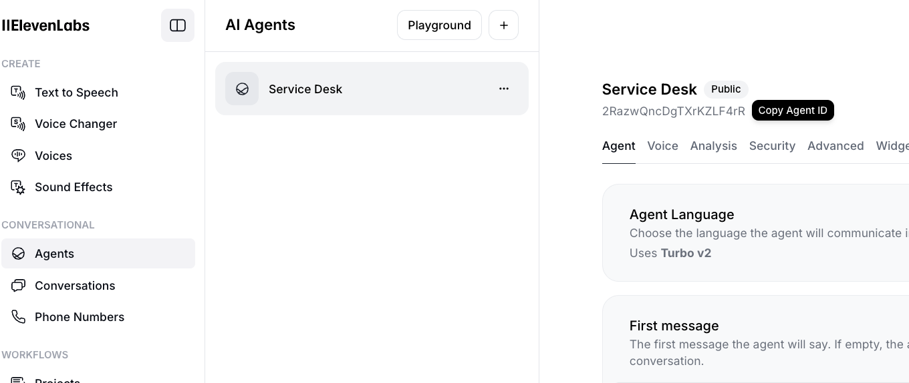

# ElevenLabs Conversational AI Template

This is a template for a NextJS v15 application that uses ElevenLabs Conversational AI.

## Getting Started

First, configure your environment variables in the `.env.local` file:

```
NEXT_PUBLIC_AGENT_ID=
ELEVENLABS_API_KEY=
```

### Create an Agent in your ElevenLabs account, then copy the Agent ID and your API Key.


Then, run the development server:

```bash
npm run dev
```

or

```bash
bun dev
```

